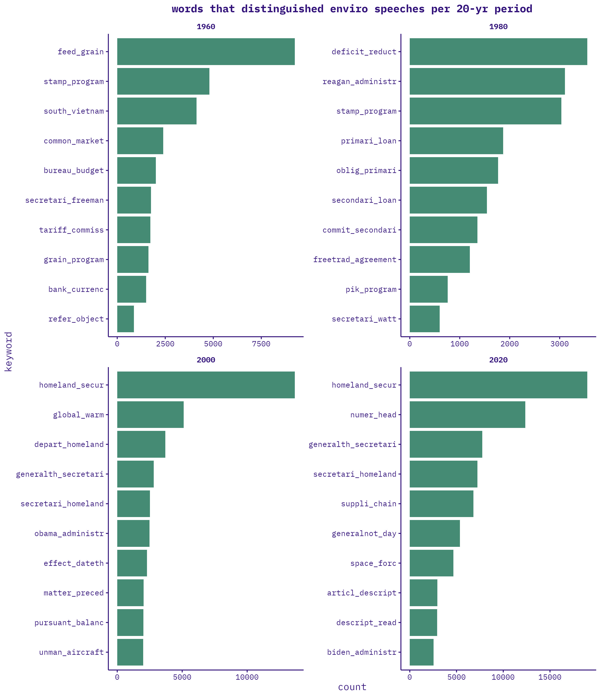
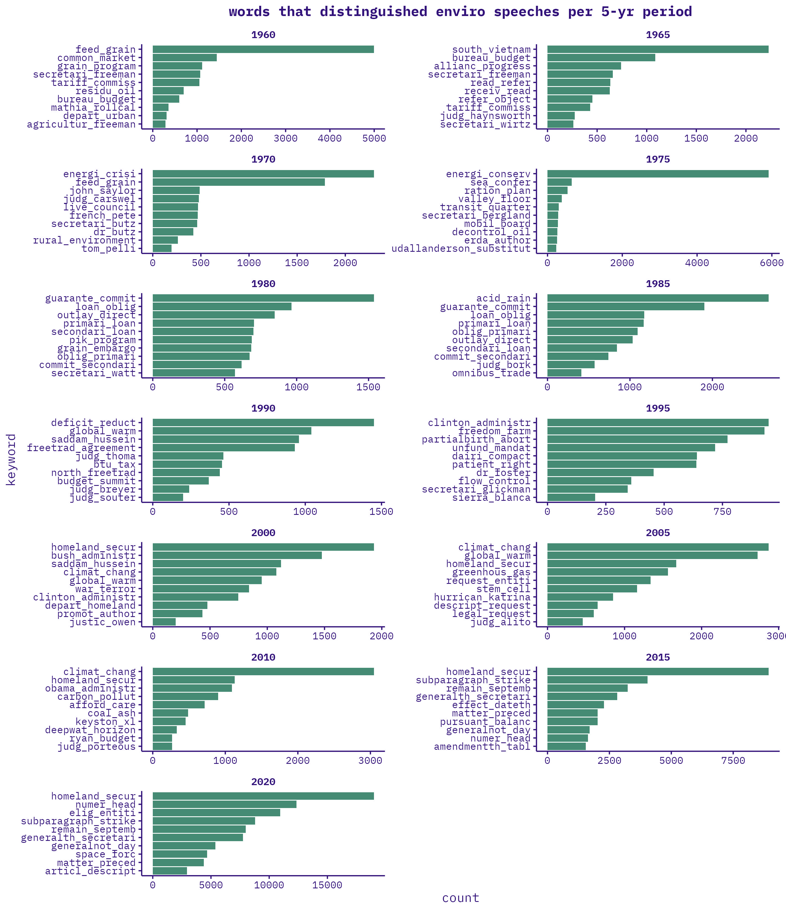
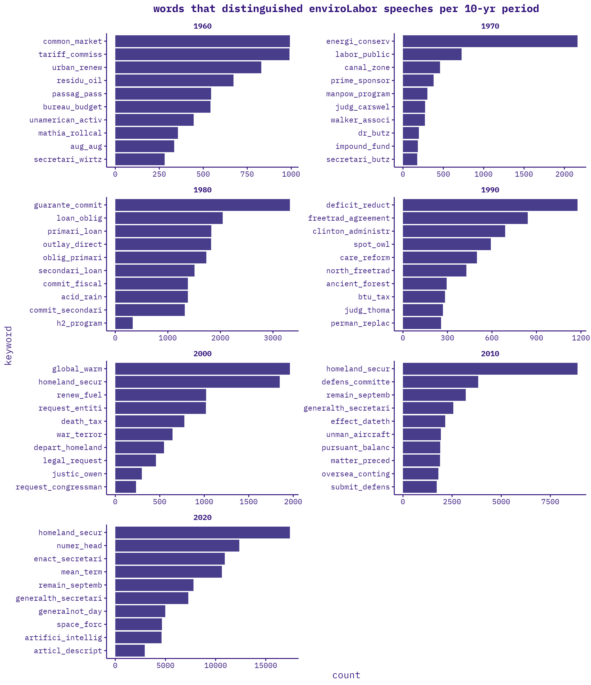
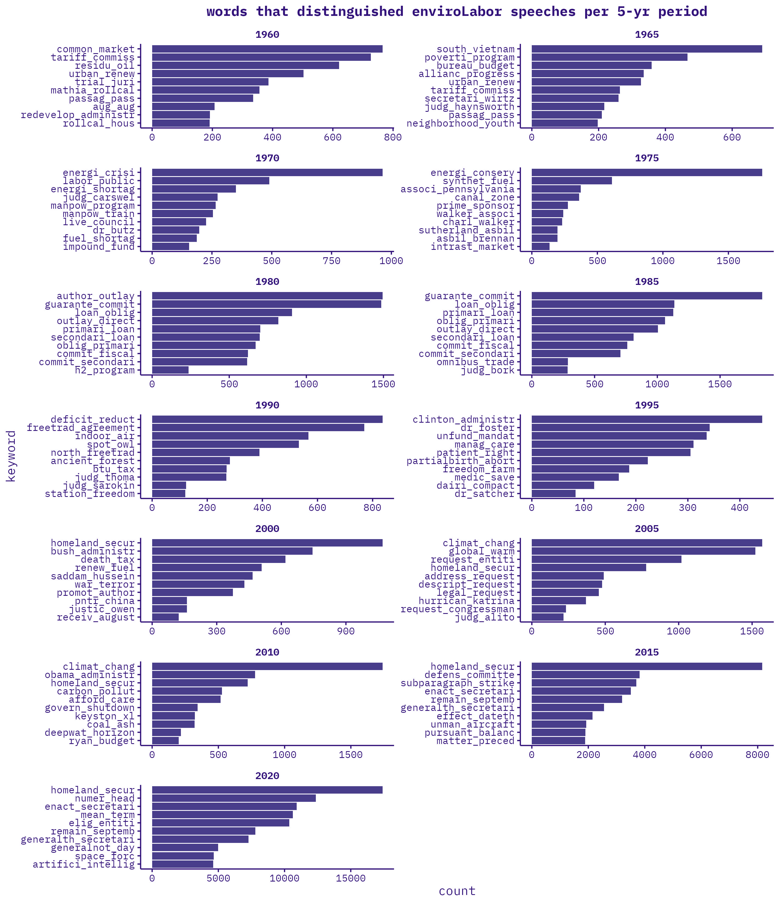
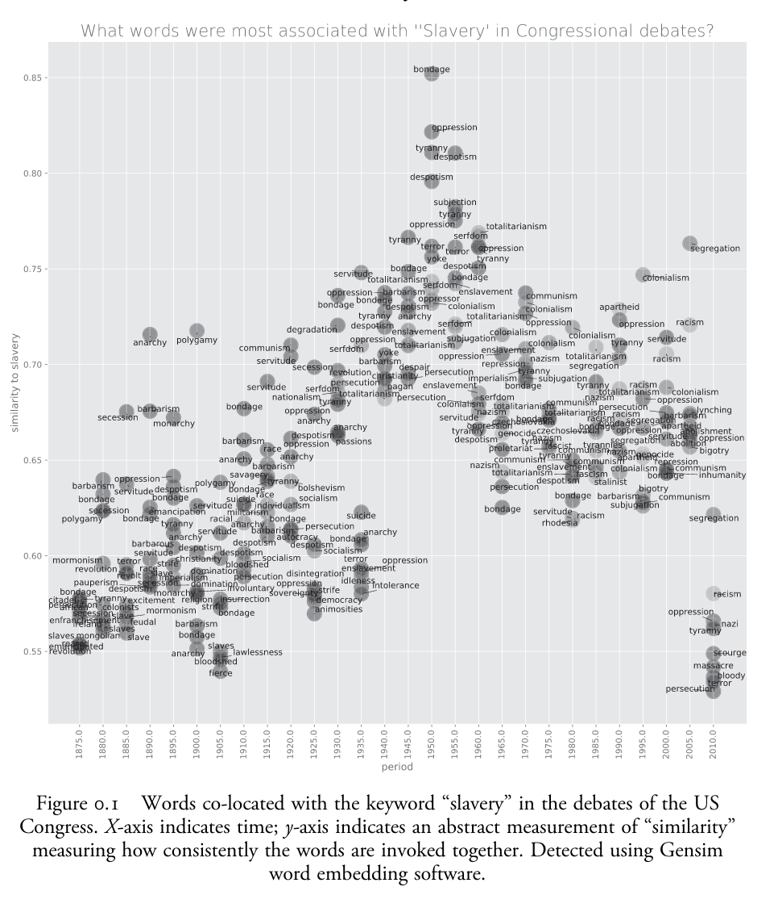

<p>

<center><font size="3">`r Sys.Date()`</font></center>

</p>

```{r setup, include=FALSE}

knitr::opts_chunk$set(echo = TRUE, warning = FALSE)
#quanteda_options(tokens_block_size = 50000)

options(repos = list(CRAN="http://cran.rstudio.com/"))
install.packages("pacman")
library(pacman)

p_load(bookdown,
       data.table,
       DataTables,
       dplyr, 
       DT,
       htmltools,
       htmlwidgets,
       forcats,
       plotly,
       quanteda,
       stopwords,
       tictoc,
       tidyverse, 
       tidytext,
       tokenizers,
       vroom)

widget_file_size <- function(p) {
  d <- tempdir()
  withr::with_dir(d, htmlwidgets::saveWidget(p, "index.html"))
  f <- file.path(d, "index.html")
  mb <- round(file.info(f)$size / 1e6, 3)
  message("File is: ", mb," MB")
}

create_dt <- function(x){
  DT::datatable(x,rownames=FALSE)
}

```

### UPDATES:
-   reran code to incorporate 1873-1900 speech data (i filtered to only speeches since 1900 as i was workshopping code to speed my scripts--should now add them back now that everything works)
-   finished processing 2016-2024 data
-   merged all data, 1873-2024
-   generated new set of environmental + labor keywords using chatgbt & re-filtered speeches
-   exploratory analysis

</p>

### KEYWORDS
```{r input data, eval=FALSE, echo=FALSE, cache=TRUE, cache.lazy=FALSE}

load("data/enviroLaborSpeeches.Rda")

enviroLaborSpeeches <- enviroLaborSpeeches %>%
  as_tibble() %>%
  select(year,
         date,
         chamber,
         environment,
         labor,
         speech_id,
         speech,
         last_name,
         state,
         total_annual_speeches)

```

<br>
chatgbt, repeated for every decade 1870-present: "give me 20 of the most common terms used related to [the environment / labor] from 1900 to 1909"

[environmental/labor keywords](https://docs.google.com/spreadsheets/d/17WtPwwvysxEEOqz-tlbKf9dBaT9RKmytpBfTvhVM1Os/edit?usp=sharing)

open question: striking balance between capturing most expansive umbrella of “env’t” and “labor” without

-   casting too wide a net and capturing non-environmental and non-labor speeches
    -   env’t: e.g., “climate” or “environment” used in alternative senses
    -   labor: e.g., “union” or “strike” used in alternative senses
-   overdetermining the issues/terms associated with each
    -   choosing keywords is raising questions about what is “environmental,” what is “labor,” etc.
        -   env’t: e.g., “urban planning”, “urbanization”, “waste management, “natural disaster”
        -   labor: e.g., “industrialization”, “globalization”, “social security”….”jobs!!”
    -   overdetermining issues—would these already be captured? am i missing older ones b/c i am more familiar with recent ones?
        -   env’t: “ocean acidification”, “sea level rise”
        -   labor: “remote work”, “gig economy”

i.e., how to capture the widest possible net of “env’t” and “labor” without capturing beyond’ env’t and labor. the fewest, vaguest possible terms that still get us what we want. 

<br>
</p>

<p>
### ANALYSIS

#### speeches per year:

```{r speeches over time, echo=FALSE, cache=TRUE}

tags$iframe(
  src = "figures/speeches_prop_by_year.html", 
  scrolling = "no", 
  frameBorder = "0",
  height=500,
  width="100%"
)

```

caveats:

-   meaningfulness of env’t vs. labor speech proportions over time: hard to compare pre- and post-2016 given different data collection methods.
-   different keyword lists drastically change this


<br>
</p>

#### top 25 bigrams:

<center>enviro</center>

```{r enviro bigram counts, echo=FALSE, message=FALSE, cache=FALSE, cache.lazy = FALSE}

tags$iframe(
  src = "figures/enviro_bigrams_top25.html", 
  scrolling = "no", 
  frameBorder = "0",
  height=500,
  width="100%"
)

```

<center>labor</center>

```{r labor bigram counts, echo=FALSE, cache=FALSE, cache.lazy = FALSE}

tags$iframe(
  src = "figures/labor_bigrams_top25.html", 
  scrolling = "no", 
  frameBorder = "0",
  height=500,
  width="100%"
)

```

<center>enviro-labor</center>

```{r enviroLabor bigram counts, echo=FALSE, cache=FALSE, cache.lazy = FALSE}

tags$iframe(
  src = "figures/enviroLabor_bigrams_top25.html", 
  scrolling = "no", 
  frameBorder = "0",
  height=500,
  width="100%"
)

```

</p>

<p>

#### top 10 bigrams by year:

<center>enviro</center>

```{r enviro bigram counts by year, echo=FALSE, message=FALSE, cache=TRUE}

load("data/R/tables/enviro_bigrams_by_year.Rda")
enviro_bigrams_by_year

```

<br>

</p>

<p>

<center>labor</center>
still running...

```{r labor bigram counts by year, eval=FALSE, echo=FALSE, message=FALSE, cache=TRUE}

load("data/R/tables/labor_bigrams_by_year.Rda")
labor_bigrams_by_year
```

<br>

</p>

<p>

<center>enviro-labor</center>

```{r enviroLabor bigram counts by year, echo=FALSE, message=FALSE, cache=TRUE}

load("data/R/tables/enviroLabor_bigrams_by_year.Rda")
enviroLabor_bigrams_by_year

```


<br>
</p>

<p>
#### tf-ipf

one promising analytical approach that Guldi uses is the term frequency-inverse period frequency (tf-ipf), which characterizes periods by the words that make them most distinct from other periods. tf-ipf can be run at multiple temporal scales–days, weeks, months, years, 5-yrs, decades, etc. In other words, by experimenting with different scales of “period,” tf-ipf can illuminate multi-scalar trends. 

##### ENVIRO
20-yr periods:

<br>
<br>
<br>
10-yr periods:

<br>
<br>
<br>
5-yr periods:

<br>
<br>
<br>
2-yr periods:

<br>
<br>

##### LABOR

still running...
<br>
<br>

##### ENVIRO-LABOR

20-yr periods:

<br>
<br>
<br>
10-yr periods:

<br>
<br>
<br>
5-yr periods:

<br>
<br>
<br>
2-yr periods:

</p>

<p>
### NEXT STEPS
-   analysis:
    -   tf-ipf
    -   triples
    -   clustering
-   final enviro/labor keywords?
-   are there meaningful differences between daily vs. bound speeches?
-   validating scraped 2016-2024 data cleaning/processing against stanford 1873-2016 data cleaning/processing
</p>

<p>

### PAPER IDEAS

#### [1] methods paper #1: tf-ipf + critical reading

how does tf-ipf, applied at different historical scales spotlight different trends/fluctuations/moments in environmental issues since the 1960s?

-   6-month
-   1-yr
-   5-yr
-   10-yr
-   20-yr
-   etc.

how do different applications of tf-ipf spotlight different historical trends/fluctuations/moments in environmental issues since the 1960s?

-   period distinctiveness (difference from all other periods)
-   absolute historical novelty (change from all previous periods)
-   historical trends (change from immediately previous period)
-   typical speech (words of average distinction)
-   last gasps (difference from all future periods)

#### [2] methods paper #3: different text mining methods + critical reading

how do different text mining approaches spotlight different historical trends/fluctuations/moments in environmental issues since the 1960s? (i.e., compare the methods)

-   period distinctiveness (tf-ipf)
-   textual averages (triples)
-   convergence/divergence (word co-occurence networks)

#### [3] results paper #1: environment (and/or labor) since 1960s

changing language/issues/debates of labor and environment, talked about together, since 1960s

-   analyze words co-occurring with "labor" and "environment" [<<<need more refined keyword] over time. 
-   critical reading of speeches to triangulate/elaborate trends
-   for example:



#### [4] results paper #2: environment since 1900s

changing environmental language/issues/debates since 1900s

-   analyze words co-occurring with environmental keywords over time
-   critical reading of speeches to triangulate/elaborate trends, iteratively inform keyword list

::: {.tocify-extend-page data-unique="tocify-extend-page" style="height: 0;"}
:::
