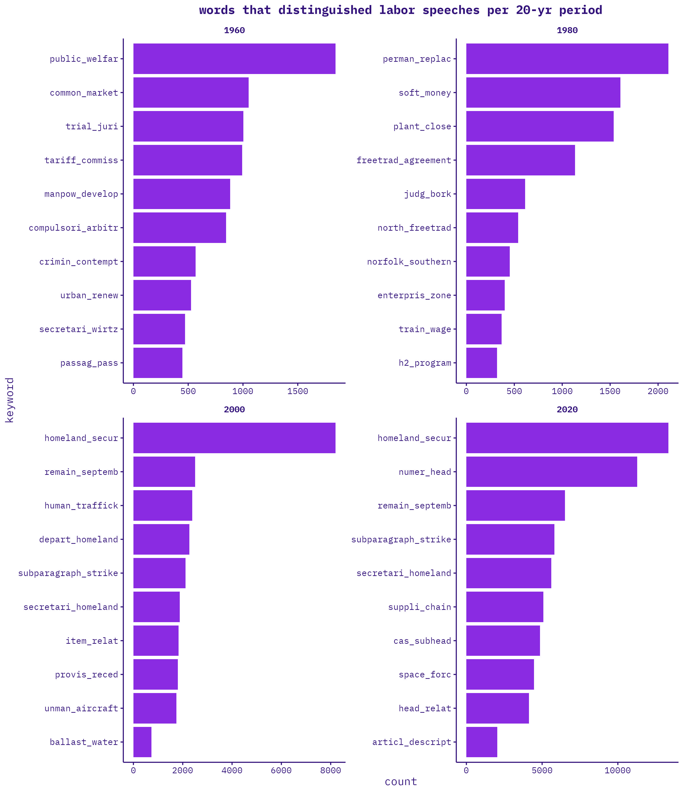

<p>

<center><font size="3">`r Sys.Date()`</font></center>

</p>

```{r setup, include=FALSE}

knitr::opts_chunk$set(echo = TRUE, warning = FALSE)
#quanteda_options(tokens_block_size = 50000)

options(repos = list(CRAN="http://cran.rstudio.com/"))
install.packages("pacman")
library(pacman)

p_load(bookdown,
       data.table,
       DataTables,
       dplyr, 
       DT,
       htmltools,
       htmlwidgets,
       forcats,
       plotly,
       quanteda,
       stopwords,
       tictoc,
       tidyverse, 
       tidytext,
       tokenizers,
       vroom)

widget_file_size <- function(p) {
  d <- tempdir()
  withr::with_dir(d, htmlwidgets::saveWidget(p, "index.html"))
  f <- file.path(d, "index.html")
  mb <- round(file.info(f)$size / 1e6, 3)
  message("File is: ", mb," MB")
}

create_dt <- function(x){
  DT::datatable(x,rownames=FALSE)
}

```

### PAPER

methods: how do different text mining approaches spotlight different historical trends/fluctuations/moments in labor-environmental (labor? environmental?) issues since the 1960s? (i.e., compare the methods)

-   period distinctiveness (tf-ipf)
-   textual averages (triples)
-   convergence/divergence (topic models + word co-occurrence networks)

### UPDATES
-   re-subset speeches with new set of environmental + labor keywords (two versions)
-   re-ran speech counts, token counts, 
-   re-ran tf-ipf code (this time labor speech data was small enough to work)
-   workshopping triples code--giving me some trouble. i'll just move on to topic models + co-occurrence networks for next week, for sake of previewing results beyond tf-ipf.

</p>

```{r input data, echo=FALSE, cache=TRUE, cache.lazy=FALSE}

load("data/enviroLaborSpeeches_v1.Rda")
enviroLaborSpeeches_v1 <- enviroLaborSpeeches_v1 %>%
  as_tibble() %>%
  select(year,
         date,
         chamber,
         environment,
         labor,
         speech_id,
         speech,
         total_annual_speeches)

load("data/enviroLaborSpeeches_v2.Rda")
enviroLaborSpeeches_v2 <- enviroLaborSpeeches_v2 %>%
  as_tibble() %>%
  select(year,
         date,
         chamber,
         environment,
         labor,
         speech_id,
         speech,
         total_annual_speeches)

enviroKeywords_v1 <- c("environmental movement",
                    "environmentalism",
                    "environmentalist",
                    "environmental activi",
                    "environmental organiz",
                    "environmental group") %>%
  as_tibble()

enviroKeywords_v2 <- c("environmental") %>%
  as_tibble()


laborKeywords_v1 <- c("labor movement",
                   "unionism",
                   "unionist",
                   "labor activi",
                   "labor organiz",# "labor organization",
                   "organized labor",
                   "labor union",
                   "trade union",
                   "industrial union",
                   "craft union") %>%
  as_tibble()

laborKeywords_v2 <- c("labor") %>%
  as_tibble()

```

### KEYWORDS

<br>
how to capture the widest possible net of “env’t” and “labor” without capturing beyond’ env’t and labor. the fewest, vaguest possible terms that still get us what we want. i.e., striking balance between capturing most expansive umbrella of “env’t” and “labor” without:

-   casting too wide a net and capturing non-environmental and non-labor speeches
-   overdetermining the issues/terms associated with each
        
i.e., my analysis should tell me when something like "globalization" is articulated specifically as a labor issue or "urbanization" is articulated specifically as an environmental issue, without preemptively compiling ALL globalization or urbanization speeches into the enviro-labor speeches dataset.

<br>
</p>
#### environmental/labor keywords v1: specific
<b>environmental v1: specific</b>

```{r enviro keywords v1, echo=FALSE}
enviroKeywords_v1
```
<br>
</p>

<b>labor v1: specific</b>

```{r labor keywords v1, echo=FALSE}
laborKeywords_v1
```
<br>
</p>

#### environmental/labor keywords v2: broad
<b>environmental v2: broad</b>

```{r enviro keywords v2, echo=FALSE}
enviroKeywords_v2
```
<br>
</p>

<b>labor v2: broad</b>

```{r labor keywords v2, echo=FALSE}
laborKeywords_v2
```
<br>
</p>

### SPEECHES
#### environmental/labor speeches: v1

```{r speeches over time v1, echo=FALSE, cache=TRUE}

tags$iframe(
  src = "figures/speeches_prop_by_year_v1.html", 
  scrolling = "no", 
  frameBorder = "0",
  height=500,
  width="100%"
)

```

<p>
<center>enviro speeches v1 (sample of n=1 per year):</center>
```{r enviro v1 speeches, echo=FALSE, cache=TRUE}

enviroLaborSpeeches_v1 %>%
  filter(environment=="Yes" & is.na(labor)==TRUE) %>%
  select(year,chamber,environment,labor,speech) %>%
  group_by(year) %>%
  sample_n(1) %>%
  arrange(year)

```
<br>
</p>

<p>
<center>labor speeches v1 (sample of n=1 per year):</center>

```{r labor v1 speeches, echo=FALSE, cache=TRUE}

enviroLaborSpeeches_v1 %>%
  filter(is.na(environment)==TRUE & labor=="Yes") %>%
  select(year,chamber,environment,labor,speech) %>%
  group_by(year) %>%
  sample_n(1) %>%
  arrange(year)

```
<br>
</p>

<p>
<center>enviro-labor speeches v1 (sample of n=1 per year):</center>

```{r enviroLabor v1 speeches, echo=FALSE, cache=TRUE}

enviroLaborSpeeches_v1 %>%
  filter(environment=="Yes" & labor=="Yes") %>%
  select(year,chamber,environment,labor,speech) %>%
  group_by(year) %>%
  sample_n(1) %>%
  arrange(year)

```
<br>
</p>

#### environmental/labor speeches: v2

<p>
<center>speeches per year v2:</center>
```{r speeches over time v2, echo=FALSE, cache=TRUE}

tags$iframe(
  src = "figures/speeches_prop_by_year_v2.html", 
  scrolling = "no", 
  frameBorder = "0",
  height=500,
  width="100%"
)

```
</p>

<p>
<center>enviro speeches v2 (sample of n=1 per year):</center>
```{r enviro v2 speeches, echo=FALSE, cache=TRUE}

enviroLaborSpeeches_v2 %>%
  filter(environment=="Yes" & is.na(labor)==TRUE) %>%
  select(year,chamber,environment,labor,speech) %>%
  group_by(year) %>%
  sample_n(1) %>%
  arrange(year) 

```
<br>
</p>

<p>
<center>labor speeches v2 (sample of n=1 per year):</center>

```{r labor v2 speeches, echo=FALSE, cache=TRUE}

enviroLaborSpeeches_v2 %>%
  filter(is.na(environment)==TRUE & labor=="Yes") %>%
  select(year,chamber,environment,labor,speech) %>%
  group_by(year) %>%
  sample_n(1) %>%
  arrange(year)

```
<br>
</p>

<p>
<center>enviro-labor speeches v2 (sample of n=1 per year):</center>

```{r enviroLabor v2 speeches, echo=FALSE, cache=TRUE}

enviroLaborSpeeches_v2 %>%
  filter(environment=="Yes" & labor=="Yes") %>%
  select(year,chamber,environment,labor,speech) %>%
  group_by(year) %>%
  sample_n(1) %>%
  arrange(year)

```
<br>
</p>

<p>
<br>
</p>

### TOKENS
#### top 25 bigrams:

<center>enviro v1</center>

```{r enviro v1 bigram counts, echo=FALSE, message=FALSE, cache=FALSE, cache.lazy = FALSE}

tags$iframe(
  src = "figures/enviro_bigrams_top25_v1.html", 
  scrolling = "no", 
  frameBorder = "0",
  height=500,
  width="100%"
)

```

<center>enviro v2</center>

```{r enviro v2 bigram counts, echo=FALSE, message=FALSE, cache=FALSE, cache.lazy = FALSE}

tags$iframe(
  src = "figures/enviro_bigrams_top25_v2.html", 
  scrolling = "no", 
  frameBorder = "0",
  height=500,
  width="100%"
)

```

<center>labor v1</center>

```{r labor v1 bigram counts, echo=FALSE, cache=FALSE, cache.lazy = FALSE}

tags$iframe(
  src = "figures/labor_bigrams_top25_v1.html", 
  scrolling = "no", 
  frameBorder = "0",
  height=500,
  width="100%"
)

```

<center>labor v2</center>

```{r labor v2 bigram counts, echo=FALSE, cache=FALSE, cache.lazy = FALSE}

tags$iframe(
  src = "figures/labor_bigrams_top25_v2.html", 
  scrolling = "no", 
  frameBorder = "0",
  height=500,
  width="100%"
)

```

<center>enviro-labor v1</center>

```{r enviroLabor v1 bigram counts, echo=FALSE, cache=FALSE, cache.lazy = FALSE}

tags$iframe(
  src = "figures/enviroLabor_bigrams_top25_v1.html", 
  scrolling = "no", 
  frameBorder = "0",
  height=500,
  width="100%"
)

```

<center>enviro-labor v2</center>

```{r enviroLabor v2 bigram counts, echo=FALSE, cache=FALSE, cache.lazy = FALSE}

tags$iframe(
  src = "figures/enviroLabor_bigrams_top25_v2.html", 
  scrolling = "no", 
  frameBorder = "0",
  height=500,
  width="100%"
)

```

</p>

<p>
#### top 10 tokens by year:

<center>enviro v1</center>

```{r enviro v1 token counts by year, echo=FALSE, message=FALSE, cache=TRUE}

load("data/R/tables/enviro_tokens_by_year_v1.Rda")
enviro_tokens_by_year_v1

```

<center>enviro v2</center>

```{r enviro v2 token counts by year, echo=FALSE, message=FALSE, cache=TRUE}

load("data/R/tables/enviro_tokens_by_year_v2.Rda")
enviro_tokens_by_year_v2

```

<br>

</p>

<p>

<center>labor v1</center>

```{r labor v1 token counts by year, echo=FALSE, message=FALSE, cache=TRUE}

load("data/R/tables/labor_tokens_by_year_v1.Rda")
labor_tokens_by_year_v1

```

<center>labor v2</center>

```{r labor v2 token counts by year, echo=FALSE, message=FALSE, cache=TRUE}

load("data/R/tables/labor_tokens_by_year_v2.Rda")
labor_tokens_by_year_v2

```

<br>

</p>

<p>

<center>enviro-labor v1</center>

```{r enviroLabor v1 token counts by year, echo=FALSE, message=FALSE, cache=TRUE}

load("data/R/tables/enviroLabor_tokens_by_year_v1.Rda")
enviroLabor_tokens_by_year_v1

```

<center>enviro-labor v2</center>

```{r enviroLabor v2 token counts by year, echo=FALSE, message=FALSE, cache=TRUE}

load("data/R/tables/enviroLabor_tokens_by_year_v2.Rda")
enviroLabor_tokens_by_year_v2

```


<br>
</p>
<p>
#### top 10 bigrams by year:

<center>enviro v1</center>

```{r enviro v1 bigram counts by year, echo=FALSE, message=FALSE, cache=TRUE}

load("data/R/tables/enviro_bigrams_by_year_v1.Rda")
enviro_bigrams_by_year_v1

```

<center>enviro v2</center>

```{r enviro v2 bigram counts by year, echo=FALSE, message=FALSE, cache=TRUE}

load("data/R/tables/enviro_bigrams_by_year_v2.Rda")
enviro_bigrams_by_year_v2

```

<br>

</p>

<p>

<center>labor v1</center>

```{r labor v1 bigram counts by year, echo=FALSE, message=FALSE, cache=TRUE}

load("data/R/tables/labor_bigrams_by_year_v1.Rda")
labor_bigrams_by_year_v1

```

<center>labor v2</center>

```{r labor v2 bigram counts by year, echo=FALSE, message=FALSE, cache=TRUE}

load("data/R/tables/labor_bigrams_by_year_v2.Rda")
labor_bigrams_by_year_v2

```

<br>

</p>

<p>

<center>enviro-labor v1</center>

```{r enviroLabor v1 bigram counts by year, echo=FALSE, message=FALSE, cache=TRUE}

load("data/R/tables/enviroLabor_bigrams_by_year_v1.Rda")
enviroLabor_bigrams_by_year_v1

```

<center>enviro-labor v2</center>

```{r enviroLabor v2 bigram counts by year, echo=FALSE, message=FALSE, cache=TRUE}

load("data/R/tables/enviroLabor_bigrams_by_year_v2.Rda")
enviroLabor_bigrams_by_year_v2

```


<br>
</p>

<p>
### TF-IPF
(run using v2 keywords, "environmental" and "labor")

#### enviro tf-ipf
20-yr periods:

<br>
<br>
<br>
10-yr periods:

<br>
<br>
<br>
5-yr periods:

<br>
<br>

#### labor tf-ipf

20-yr periods:

<br>
<br>
<br>
10-yr periods:

<br>
<br>
<br>
5-yr periods:

</p>

#### enviro-labor tf-ipf

20-yr periods:

<br>
<br>
<br>
10-yr periods:

<br>
<br>
<br>
5-yr periods:

</p>

<p>
### NEXT STEPS
-   CLC presentation thursday (5 mins, 2-4 slides)
-   subsetting:
    -   final enviro/labor keywords?
    -   figure out encoding problem
-   analysis:
    -   triples
    -   topic modeling 
-   validation:
    -   are there meaningful differences between daily vs. bound speeches?
    -   validating scraped 2016-2024 data cleaning/processing against stanford 1873-2016 data cleaning/processing
</p>

::: {.tocify-extend-page data-unique="tocify-extend-page" style="height: 0;"}
:::
