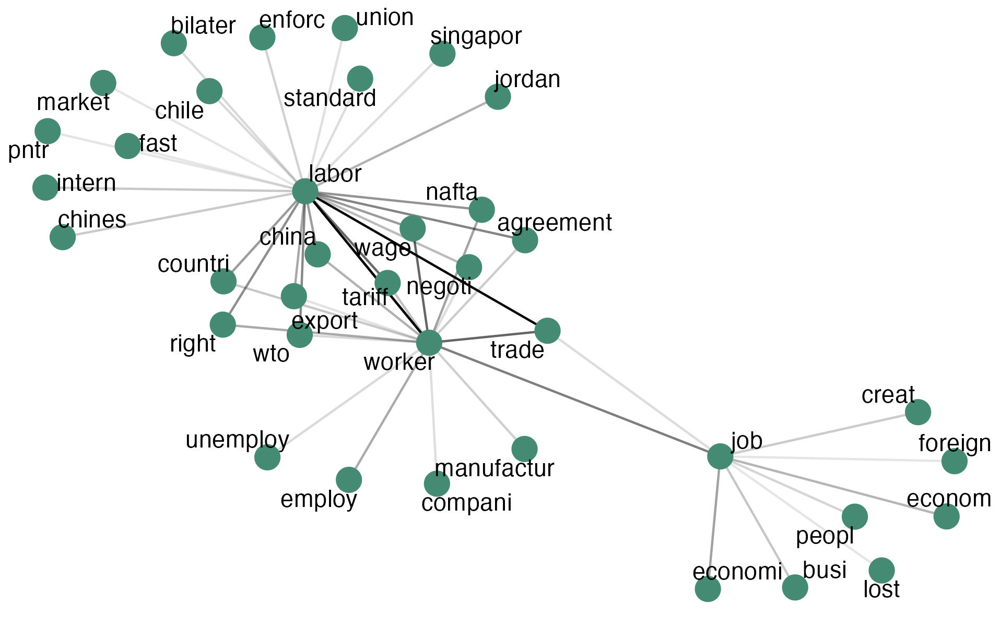

<p>

<center><b><font size="3">`r Sys.Date()`</font></b></center>

</p>

```{r setup, include=FALSE}

knitr::opts_chunk$set(echo = TRUE, warning = FALSE)
#quanteda_options(tokens_block_size = 50000)

options(repos = list(CRAN="http://cran.rstudio.com/"))
install.packages("pacman")
library(pacman)

p_load(bookdown,
       data.table,
       DataTables,
       dplyr, 
       DT,
       htmltools,
       htmlwidgets,
       forcats,
       plotly,
       quanteda,
       stopwords,
       tictoc,
       tidyverse, 
       tidytext,
       tokenizers,
       vroom)

```

### PAPER

methods: how do different text mining approaches spotlight different historical trends/fluctuations/moments in labor-environmental (labor? environmental?) issues since the 1960s? (i.e., compare the methods)

-   period distinctiveness (tf-ipf)
-   textual averages (triples)
-   convergence/divergence (topic models + word co-occurrence networks)

(+ showing impact of different keyword choices)

### UPDATES
-   re-ran all prior analyses
-   top bigrams by period
-   word co-occurence networks
-   topic modeling

</p>

```{r input data, include=FALSE, cache=TRUE, cache.lazy=FALSE}

load("data/enviroLaborSpeeches.Rda")
enviroLaborSpeeches <- enviroLaborSpeeches %>%
  filter(year>=1960)

# enviroLaborSpeeches <- enviroLaborSpeeches %>%
#   as_tibble() %>%
#   select(year,
#          date,
#          chamber,
#          environment,
#          labor,
#          speech_id,
#          speech,
#          total_annual_speeches)

enviroKeywords <- c("environmental") %>%
  as_tibble()

laborKeywords <- c("labor") %>%
  as_tibble()

hein_enviroKeywords <- "data/phrase_clusters/keywords.txt" %>%
  vroom(delim="|") %>%
  filter(topic=="environment") %>%
  select(phrase) %>%
  rename(keyword=phrase)

hein_enviroExcluded <- "data/phrase_clusters/false_matches.txt" %>%
  vroom(delim="|") %>%
  filter(topic=="environment") %>%
  select(phrase) %>%
  rename(excluded_phrase=phrase)

hein_enviroIncluded <- "data/phrase_clusters/topic_phrases.txt" %>%
  vroom(delim="|") %>%
  filter(topic=="environment") %>%
  select(phrase) %>%
  rename(topic_phrase=phrase)

hein_laborKeywords <- "data/phrase_clusters/keywords.txt" %>%
  vroom(delim="|") %>%
  filter(topic=="labor") %>%
  select(phrase) %>%
  rename(keyword=phrase)

hein_laborExcluded <- "data/phrase_clusters/false_matches.txt" %>%
  vroom(delim="|") %>%
  filter(topic=="labor") %>%
  select(phrase) %>%
  rename(excluded_phrase=phrase)

hein_laborIncluded <- "data/phrase_clusters/topic_phrases.txt" %>%
  vroom(delim="|") %>%
  filter(topic=="labor") %>%
  select(phrase) %>%
  rename(topic_phrase=phrase)

hein_badSyntax <- "data/vocabulary/master_list.txt" %>%
  vroom(delim="|") %>%
  rename("classify" = "_classify") %>%
  filter(classify != "vocab") %>%
  mutate(phrase=str_replace_all(phrase," ","_"))

```

### KEYWORDS

<br>
</p>
#### environmental keyword

```{r enviro keywords , echo=FALSE}
enviroKeywords
```
<br>
</p>

#### labor keyword

```{r labor keywords , echo=FALSE}
laborKeywords
```
<br>
</p>

### SPEECHES

#### speech counts since 1960: 
```{r speech counts since 1960, echo=FALSE, cache=TRUE}

tags$iframe(
  src = "figures/speeches_by_year.html", 
  scrolling = "no", 
  frameBorder = "0",
  height=500,
  width="100%"
)

```

#### speech proportions since 1960: 
```{r speech proportions since 1960, echo=FALSE, cache=TRUE}

tags$iframe(
  src = "figures/speeches_prop_by_year.html", 
  scrolling = "no", 
  frameBorder = "0",
  height=500,
  width="100%"
)

```

#### speech sample  (n=1 per year):
```{r enviroLabor  speeches, echo=FALSE, cache=TRUE}

enviroLaborSpeeches %>%
  select(year,chamber,environment,labor,speech) %>%
  group_by(year) %>%
  sample_n(1) %>%
  arrange(year)

```
<br>
</p>

### ANALYSIS: bigram counts 
#### ENVIRO:

<center><b>top 20 enviro bigrams per 20-year period (since 1960)</b></center>
```{r top enviro bigrams by year 20-yr period, echo=FALSE, message=FALSE, cache=FALSE, cache.lazy = FALSE}

tags$iframe(
  src = "figures/top_enviroBigrams_20yr_1960.html", 
  scrolling = "no", 
  frameBorder = "0",
  height=500,
  width="100%"
)

tags$iframe(
  src = "figures/top_enviroBigrams_20yr_1980.html", 
  scrolling = "no", 
  frameBorder = "0",
  height=500,
  width="100%"
)

tags$iframe(
  src = "figures/top_enviroBigrams_20yr_2000.html", 
  scrolling = "no", 
  frameBorder = "0",
  height=500,
  width="100%"
)

```

<br>
</p>
<p>

<center><b>top 20 enviro bigrams per 15-year period (since 1965)</b></center>
```{r top enviro bigrams by year 15-yr period, echo=FALSE, message=FALSE, cache=FALSE, cache.lazy = FALSE}

tags$iframe(
  src = "figures/top_enviroBigrams_15yr_1965_1980.html", 
  scrolling = "no", 
  frameBorder = "0",
  height=500,
  width="100%"
)

tags$iframe(
  src = "figures/top_enviroBigrams_15yr_1995_2010.html", 
  scrolling = "no", 
  frameBorder = "0",
  height=500,
  width="100%"
)

```

<br>
</p>
<p>

<center><b>top 20 enviro bigrams per 5-year period (since 1965)</b></center>
```{r top enviro bigrams by year 5-yr period, echo=FALSE, message=FALSE, cache=FALSE, cache.lazy = FALSE}

tags$iframe(
  src = "figures/top_enviroBigrams_5yr_1965_1970.html", 
  scrolling = "no", 
  frameBorder = "0",
  height=500,
  width="100%"
)

tags$iframe(
  src = "figures/top_enviroBigrams_5yr_1975_1980.html", 
  scrolling = "no", 
  frameBorder = "0",
  height=500,
  width="100%"
)

tags$iframe(
  src = "figures/top_enviroBigrams_5yr_1985_1990.html", 
  scrolling = "no", 
  frameBorder = "0",
  height=500,
  width="100%"
)

tags$iframe(
  src = "figures/top_enviroBigrams_5yr_1995_2000.html", 
  scrolling = "no", 
  frameBorder = "0",
  height=500,
  width="100%"
)

tags$iframe(
  src = "figures/top_enviroBigrams_5yr_2005_2010.html", 
  scrolling = "no", 
  frameBorder = "0",
  height=500,
  width="100%"
)

tags$iframe(
  src = "figures/top_enviroBigrams_5yr_2015_2020.html", 
  scrolling = "no", 
  frameBorder = "0",
  height=500,
  width="100%"
)

```

<br>
</p>
<p>

#### LABOR:

<center><b>top 20 labor bigrams per 20-year period (since 1960)</b></center>
```{r top labor bigrams by year 20-yr period, echo=FALSE, message=FALSE, cache=FALSE, cache.lazy = FALSE}

tags$iframe(
  src = "figures/top_laborBigrams_20yr_1960.html", 
  scrolling = "no", 
  frameBorder = "0",
  height=500,
  width="100%"
)

tags$iframe(
  src = "figures/top_laborBigrams_20yr_1980.html", 
  scrolling = "no", 
  frameBorder = "0",
  height=500,
  width="100%"
)

tags$iframe(
  src = "figures/top_laborBigrams_20yr_2000.html", 
  scrolling = "no", 
  frameBorder = "0",
  height=500,
  width="100%"
)

```

<br>
</p>
<p>

<center><b>top 20 labor bigrams per 15-year period (since 1965)</b></center>
```{r top labor bigrams by year 15-yr period, echo=FALSE, message=FALSE, cache=FALSE, cache.lazy = FALSE}

tags$iframe(
  src = "figures/top_laborBigrams_15yr_1965_1980.html", 
  scrolling = "no", 
  frameBorder = "0",
  height=500,
  width="100%"
)

tags$iframe(
  src = "figures/top_laborBigrams_15yr_1995_2010.html", 
  scrolling = "no", 
  frameBorder = "0",
  height=500,
  width="100%"
)

```

<br>
</p>
<p>

<center><b>top 20 labor bigrams per 5-year period (since 1965)</b></center>
```{r top labor bigrams by year 5-yr period, echo=FALSE, message=FALSE, cache=FALSE, cache.lazy = FALSE}

tags$iframe(
  src = "figures/top_laborBigrams_5yr_1965_1970.html", 
  scrolling = "no", 
  frameBorder = "0",
  height=500,
  width="100%"
)

tags$iframe(
  src = "figures/top_laborBigrams_5yr_1975_1980.html", 
  scrolling = "no", 
  frameBorder = "0",
  height=500,
  width="100%"
)

tags$iframe(
  src = "figures/top_laborBigrams_5yr_1985_1990.html", 
  scrolling = "no", 
  frameBorder = "0",
  height=500,
  width="100%"
)

tags$iframe(
  src = "figures/top_laborBigrams_5yr_1995_2000.html", 
  scrolling = "no", 
  frameBorder = "0",
  height=500,
  width="100%"
)

tags$iframe(
  src = "figures/top_laborBigrams_5yr_2005_2010.html", 
  scrolling = "no", 
  frameBorder = "0",
  height=500,
  width="100%"
)

tags$iframe(
  src = "figures/top_laborBigrams_5yr_2015_2020.html", 
  scrolling = "no", 
  frameBorder = "0",
  height=500,
  width="100%"
)

```

<br>
</p>
<p>

#### ENVIRO-LABOR:

<center><b>top 20 enviroLabor bigrams per 20-year period (since 1960)</b></center>
```{r top enviroLabor bigrams by year 20-yr period, echo=FALSE, message=FALSE, cache=FALSE, cache.lazy = FALSE}

tags$iframe(
  src = "figures/top_enviroLaborBigrams_20yr_1960.html", 
  scrolling = "no", 
  frameBorder = "0",
  height=500,
  width="100%"
)

tags$iframe(
  src = "figures/top_enviroLaborBigrams_20yr_1980.html", 
  scrolling = "no", 
  frameBorder = "0",
  height=500,
  width="100%"
)

tags$iframe(
  src = "figures/top_enviroLaborBigrams_20yr_2000.html", 
  scrolling = "no", 
  frameBorder = "0",
  height=500,
  width="100%"
)

```

<br>
</p>
<p>

<center><b>top 20 enviroLabor bigrams per 15-year period (since 1965)</b></center>
```{r top enviroLabor bigrams by year 15-yr period, echo=FALSE, message=FALSE, cache=FALSE, cache.lazy = FALSE}

tags$iframe(
  src = "figures/top_enviroLaborBigrams_15yr_1965_1980.html", 
  scrolling = "no", 
  frameBorder = "0",
  height=500,
  width="100%"
)

tags$iframe(
  src = "figures/top_enviroLaborBigrams_15yr_1995_2010.html", 
  scrolling = "no", 
  frameBorder = "0",
  height=500,
  width="100%"
)

```

<br>
</p>
<p>

<center><b>top 20 enviroLabor bigrams per 5-year period (since 1965)</b></center>
```{r top enviroLabor bigrams by year 5-yr period, echo=FALSE, message=FALSE, cache=FALSE, cache.lazy = FALSE}

tags$iframe(
  src = "figures/top_enviroLaborBigrams_5yr_1965_1970.html", 
  scrolling = "no", 
  frameBorder = "0",
  height=500,
  width="100%"
)

tags$iframe(
  src = "figures/top_enviroLaborBigrams_5yr_1975_1980.html", 
  scrolling = "no", 
  frameBorder = "0",
  height=500,
  width="100%"
)

tags$iframe(
  src = "figures/top_enviroLaborBigrams_5yr_1985_1990.html", 
  scrolling = "no", 
  frameBorder = "0",
  height=500,
  width="100%"
)

tags$iframe(
  src = "figures/top_enviroLaborBigrams_5yr_1995_2000.html", 
  scrolling = "no", 
  frameBorder = "0",
  height=500,
  width="100%"
)

tags$iframe(
  src = "figures/top_enviroLaborBigrams_5yr_2005_2010.html", 
  scrolling = "no", 
  frameBorder = "0",
  height=500,
  width="100%"
)

tags$iframe(
  src = "figures/top_enviroLaborBigrams_5yr_2015_2020.html", 
  scrolling = "no", 
  frameBorder = "0",
  height=500,
  width="100%"
)

```

<br>
</p>
<p>

<center><b>top 20 enviroLabor bigrams per 2-year period (since 2000)</b></center>
```{r top enviroLabor bigrams by year 2-yr period, echo=FALSE, message=FALSE, cache=FALSE, cache.lazy = FALSE}

tags$iframe(
  src = "figures/top_enviroLaborBigrams_2yr_2000_2002.html", 
  scrolling = "no", 
  frameBorder = "0",
  height=500,
  width="100%"
)

tags$iframe(
  src = "figures/top_enviroLaborBigrams_2yr_2004_2006.html", 
  scrolling = "no", 
  frameBorder = "0",
  height=500,
  width="100%"
)

tags$iframe(
  src = "figures/top_enviroLaborBigrams_2yr_2008_2010.html", 
  scrolling = "no", 
  frameBorder = "0",
  height=500,
  width="100%"
)

tags$iframe(
  src = "figures/top_enviroLaborBigrams_2yr_2012_2014.html", 
  scrolling = "no", 
  frameBorder = "0",
  height=500,
  width="100%"
)

tags$iframe(
  src = "figures/top_enviroLaborBigrams_2yr_2016_2018.html", 
  scrolling = "no", 
  frameBorder = "0",
  height=500,
  width="100%"
)

tags$iframe(
  src = "figures/top_enviroLaborBigrams_2yr_2020_2022.html", 
  scrolling = "no", 
  frameBorder = "0",
  height=500,
  width="100%"
)

```

<br>
</p>
<p>


### ANALYSIS: tp-ipf 

#### ENVIRO
20-yr periods:


<br>
<br>
<br>
15-yr periods:

<br>
<br>
<br>
5-yr periods:

<br>
<br>
<br>

#### LABOR
20-yr periods:


<br>
<br>
<br>
15-yr periods:

<br>
<br>
<br>
15-yr periods:


#### ENVIRO-LABOR
20-yr periods:


<br>
<br>
<br>
15-yr periods:

<br>
<br>
<br>
5-yr periods:

<br>
<br>
<br>
2-yr periods:

<br>
<br>
<br>

### ANALYSIS: co-occurrence networks

#### ENVIRO-LABOR SPEECHES

##### top co-occurring words per 15-yr period:

<center><b>1965</b></center>

<br>
<br>
<br>
<center><b>1980</b></center>

<br>
<br>
<br>
<center><b>1995</b></center>

<br>
<br>
<br>
<center><b>2010</b></center>

<br>
<br>
<br>

##### top co-occurring words per 5-yr period:

<center><b>1965</b></center>

<br>
<br>
<br>
<center><b>1970</b></center>

<br>
<br>
<br>
<center><b>1975</b></center>

<br>
<br>
<br>
<center><b>1980</b></center>

<br>
<br>
<br>
<center><b>1985</b></center>

<br>
<br>
<br>
<center><b>1990</b></center>

<br>
<br>
<br>
<center><b>1995</b></center>

<br>
<br>
<br>
<center><b>2000</b></center>

<br>
<br>
<br>
<center><b>2005</b></center>

<br>
<br>
<br>
<center><b>2010</b></center>

<br>
<br>
<br>
<center><b>2015</b></center>

<br>
<br>
<br>
<center><b>2020</b></center>


##### top co-occurring bigrams per 15-yr period:

<center><b>1965</b></center>

<br>
<br>
<br>
<center><b>1980</b></center>

<br>
<br>
<br>
<center><b>1995</b></center>

<br>
<br>
<br>
<center><b>2010</b></center>

<br>
<br>
<br>

##### top co-occurring bigrams per 5-yr period:
<center><b>1965</b></center>

<br>
<br>
<br>
<center><b>1970</b></center>

<br>
<br>
<br>
<center><b>1975</b></center>

<br>
<br>
<br>
<center><b>1980</b></center>

<br>
<br>
<br>
<center><b>1985</b></center>

<br>
<br>
<br>
<center><b>1990</b></center>

<br>
<br>
<br>
<center><b>1995</b></center>

<br>
<br>
<br>
<center><b>2000</b></center>

<br>
<br>
<br>
<center><b>2005</b></center>

<br>
<br>
<br>
<center><b>2010</b></center>

<br>
<br>
<br>
<center><b>2015</b></center>

<br>
<br>
<br>
<center><b>2020</b></center>


#### LABOR TERMS IN ENVIRO SPEECHES
##### top co-occurring words with "labor", "worker", or "job" in enviro speeches per 15-yr period:
<center><b>1965</b></center>

<br>
<br>
<br>
<center><b>1980</b></center>


<br>
<br>
<br>
<center><b>1995</b></center>

<br>
<br>
<br>
<center><b>2010</b></center>


<br>
<br>
<br>

##### top co-occurring words with "labor", "worker", or "job" in enviro speeches per 5-yr period:
<center><b>1965</b></center>

<br>
<br>
<br>
<center><b>1970</b></center>

<br>
<br>
<br>
<center><b>1975</b></center>


<br>
<br>
<br>
<center><b>1980</b></center>


<br>
<br>
<br>
<center><b>1985</b></center>


<br>
<br>
<br>
<center><b>1990</b></center>


<br>
<br>
<br>
<center><b>1995</b></center>


<br>
<br>
<br>
<center><b>2000</b></center>


<br>
<br>
<br>
<center><b>2005</b></center>


<br>
<br>
<br>
<center><b>2010</b></center>


<br>
<br>
<br>
<center><b>2015</b></center>

<br>
<br>
<br>
<center><b>2020</b></center>


### ANALYSIS: topic modeling

#### enviro-labor speech topics (k=9) per 15-yr period:

<center><b>1965</b></center>

<br>
<br>
<br>

<center><b>1980</b></center>

<br>
<br>
<br>

<center><b>1995</b></center>


<br>
<br>
<br>

<center><b>2010</b></center>


### NEXT STEPS
-   analysis:
    -   co-occurences (cont.)
    -   topic modeling (cont.)
    -   triples (?)
    -   stanford keywords? (see below)
-   validation:
    -   scraping data since 1995 using my method (*not a priority)
</p>


#### hein topic: environmental
<b>keywords:</b>

```{r hein enviro keywords, echo=FALSE}
hein_enviroKeywords
```

<b>included phrases:</b>
```{r hein included enviro phrases, echo=FALSE}
hein_enviroIncluded
```

<b>excluded phrases:</b>
```{r hein excluded enviro phrases, echo=FALSE}
hein_enviroExcluded
```
<br>
</p>

#### hein topic: labor
<b>keywords:</b>

```{r hein labor keywords, echo=FALSE}
hein_laborKeywords
```

<b>included phrases:</b>
```{r hein included labor phrases, echo=FALSE}
hein_laborIncluded
```

<b>excluded phrases:</b>
```{r hein excluded labor phrases, echo=FALSE}
hein_laborExcluded
```
<br>
</p>

::: {.tocify-extend-page data-unique="tocify-extend-page" style="height: 0;"}
:::
