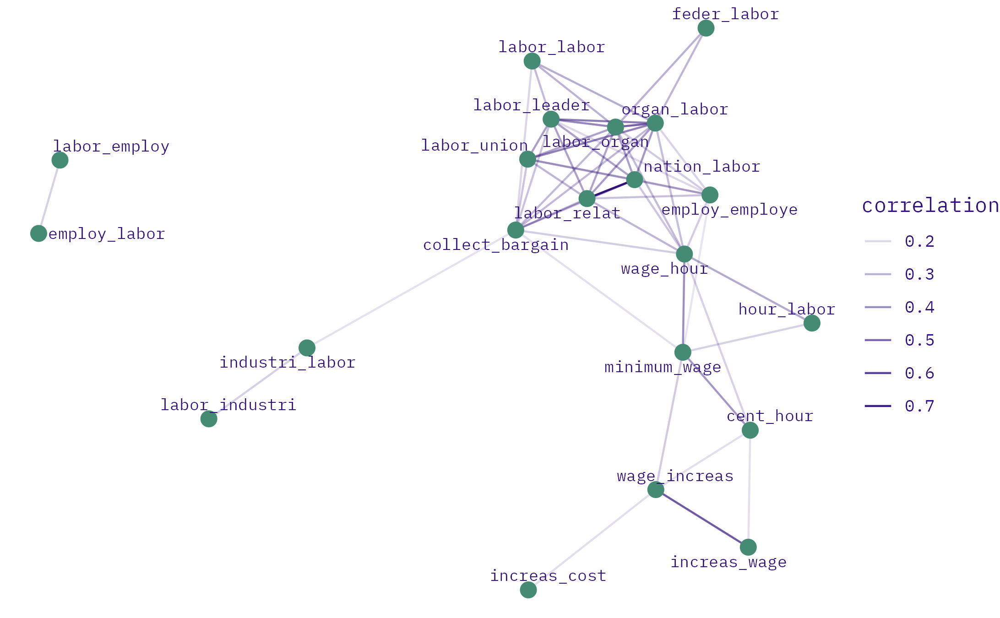
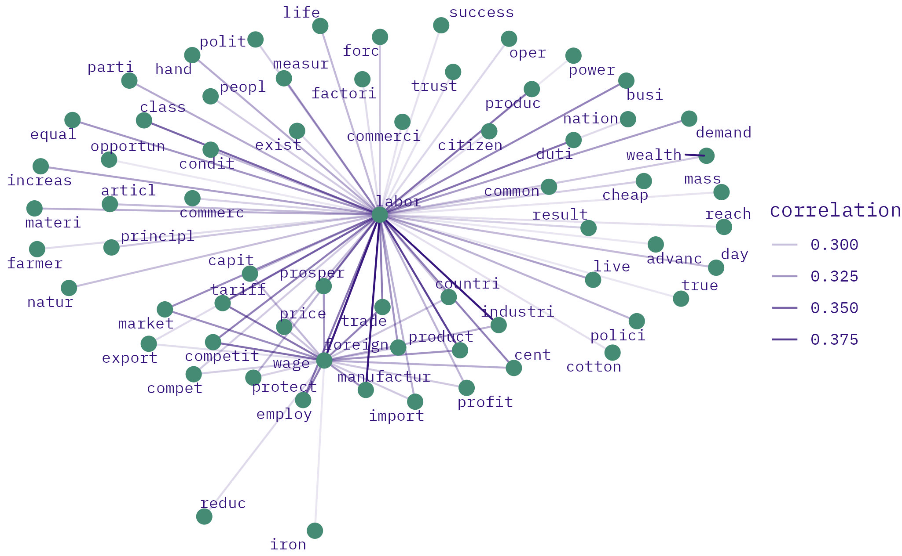

# ENVIRO

## counts

### pre-/post-war
```{r top enviro bigrams pre- vs. post-war period, echo=FALSE, message=FALSE, cache=FALSE, cache.lazy = FALSE}

tags$iframe(
  src = "figures/top_enviro_bigrams_pre_war.html",
  scrolling = "no",
  frameBorder = "0",
  height=500,
  width="100%"
)

tags$iframe(
  src = "figures/top_enviro_bigrams_post_war.html",
  scrolling = "no",
  frameBorder = "0",
  height=500,
  width="100%"
)

```

### 25-yr 
```{r top enviro bigrams by year 25-yr period, echo=FALSE, message=FALSE, cache=FALSE, cache.lazy = FALSE}

tags$iframe(
  src = "figures/top_enviroBigrams_25yr_1875_1900.html", 
  scrolling = "no", 
  frameBorder = "0",
  height=400,
  width="100%"
)

tags$iframe(
  src = "figures/top_enviroBigrams_25yr_1925_1950.html", 
  scrolling = "no", 
  frameBorder = "0",
  height=400,
  width="100%"
)

tags$iframe(
  src = "figures/top_enviroBigrams_25yr_1975_2000.html", 
  scrolling = "no", 
  frameBorder = "0",
  height=400,
  width="100%"
)

```

### 20-yr
```{r top enviro bigrams by year 20-yr period, echo=FALSE, message=FALSE, cache=FALSE, cache.lazy = FALSE}


tags$iframe(
  src = "figures/top_enviroBigrams_20yr_1900_1920.html", 
  scrolling = "no", 
  frameBorder = "0",
  height=400,
  width="100%"
)

tags$iframe(
  src = "figures/top_enviroBigrams_20yr_1940_1960.html", 
  scrolling = "no", 
  frameBorder = "0",
  height=400,
  width="100%"
)

tags$iframe(
  src = "figures/top_enviroBigrams_20yr_1980_2000.html", 
  scrolling = "no", 
  frameBorder = "0",
  height=400,
  width="100%"
)

```

### 15-yr
```{r top enviro bigrams by year 15-yr period, echo=FALSE, message=FALSE, cache=FALSE, cache.lazy = FALSE}


tags$iframe(
  src = "figures/top_enviroBigrams_15yr_1905_1920.html", 
  scrolling = "no", 
  frameBorder = "0",
  height=400,
  width="100%"
)

tags$iframe(
  src = "figures/top_enviroBigrams_15yr_1935_1950.html", 
  scrolling = "no", 
  frameBorder = "0",
  height=400,
  width="100%"
)

tags$iframe(
  src = "figures/top_enviroBigrams_15yr_1965_1980.html", 
  scrolling = "no", 
  frameBorder = "0",
  height=400,
  width="100%"
)

tags$iframe(
  src = "figures/top_enviroBigrams_15yr_1995_2010.html", 
  scrolling = "no", 
  frameBorder = "0",
  height=400,
  width="100%"
)

```

### 10-yr
```{r top enviro bigrams by year 10-yr period, echo=FALSE, message=FALSE, cache=FALSE, cache.lazy = FALSE}

tags$iframe(
  src = "figures/top_enviroBigrams_10yr_1890_1900.html", 
  scrolling = "no", 
  frameBorder = "0",
  height=400,
  width="100%"
)

tags$iframe(
  src = "figures/top_enviroBigrams_10yr_1910_1920.html", 
  scrolling = "no", 
  frameBorder = "0",
  height=400,
  width="100%"
)

tags$iframe(
  src = "figures/top_enviroBigrams_10yr_1930_1940.html", 
  scrolling = "no", 
  frameBorder = "0",
  height=400,
  width="100%"
)

tags$iframe(
  src = "figures/top_enviroBigrams_10yr_1950_1960.html", 
  scrolling = "no", 
  frameBorder = "0",
  height=400,
  width="100%"
)

tags$iframe(
  src = "figures/top_enviroBigrams_10yr_1970_1980.html", 
  scrolling = "no", 
  frameBorder = "0",
  height=400,
  width="100%"
)

tags$iframe(
  src = "figures/top_enviroBigrams_10yr_1990_2000.html", 
  scrolling = "no", 
  frameBorder = "0",
  height=400,
  width="100%"
)

tags$iframe(
  src = "figures/top_enviroBigrams_10yr_2010_2020.html", 
  scrolling = "no", 
  frameBorder = "0",
  height=400,
  width="100%"
)


```


## tf-ipf

### pre-/post-war 
```{r most distinguishing enviro bigrams pre- vs. post-war period, echo=FALSE, message=FALSE, cache=FALSE, cache.lazy = FALSE}

tags$iframe(
  src = "figures/tfipf_enviroBigrams_pre_vs_post_war.html", 
  scrolling = "no", 
  frameBorder = "0",
  height=400,
  width="100%"
)

```

### 25-yr
```{r most distinguishing enviro bigrams by year 25-yr period, echo=FALSE, message=FALSE, cache=FALSE, cache.lazy = FALSE}

tags$iframe(
  src = "figures/tfipf_enviroBigrams_25yr_1875_1900.html", 
  scrolling = "no", 
  frameBorder = "0",
  height=400,
  width="100%"
)

tags$iframe(
  src = "figures/tfipf_enviroBigrams_25yr_1925_1950.html", 
  scrolling = "no", 
  frameBorder = "0",
  height=400,
  width="100%"
)

tags$iframe(
  src = "figures/tfipf_enviroBigrams_25yr_1975_2000.html", 
  scrolling = "no", 
  frameBorder = "0",
  height=400,
  width="100%"
)

```

### 20-yr 
```{r most distinguishing enviro bigrams by year 20-yr period, echo=FALSE, message=FALSE, cache=FALSE, cache.lazy = FALSE}


tags$iframe(
  src = "figures/tfipf_enviroBigrams_20yr_1900_1920.html", 
  scrolling = "no", 
  frameBorder = "0",
  height=400,
  width="100%"
)

tags$iframe(
  src = "figures/tfipf_enviroBigrams_20yr_1940_1960.html", 
  scrolling = "no", 
  frameBorder = "0",
  height=400,
  width="100%"
)

tags$iframe(
  src = "figures/tfipf_enviroBigrams_20yr_1980_2000.html", 
  scrolling = "no", 
  frameBorder = "0",
  height=400,
  width="100%"
)

```

### 15-yr
```{r most distinguishing enviro bigrams by year 15-yr period, echo=FALSE, message=FALSE, cache=FALSE, cache.lazy = FALSE}


tags$iframe(
  src = "figures/tfipf_enviroBigrams_15yr_1905_1920.html", 
  scrolling = "no", 
  frameBorder = "0",
  height=400,
  width="100%"
)

tags$iframe(
  src = "figures/tfipf_enviroBigrams_15yr_1935_1950.html", 
  scrolling = "no", 
  frameBorder = "0",
  height=400,
  width="100%"
)

tags$iframe(
  src = "figures/tfipf_enviroBigrams_15yr_1965_1980.html", 
  scrolling = "no", 
  frameBorder = "0",
  height=400,
  width="100%"
)

tags$iframe(
  src = "figures/tfipf_enviroBigrams_15yr_1995_2010.html", 
  scrolling = "no", 
  frameBorder = "0",
  height=400,
  width="100%"
)

```

### 10-yr 
```{r most distinguishing enviro bigrams by year 10-yr period, echo=FALSE, message=FALSE, cache=FALSE, cache.lazy = FALSE}

tags$iframe(
  src = "figures/tfipf_enviroBigrams_10yr_1890_1900.html", 
  scrolling = "no", 
  frameBorder = "0",
  height=400,
  width="100%"
)

tags$iframe(
  src = "figures/tfipf_enviroBigrams_10yr_1910_1920.html", 
  scrolling = "no", 
  frameBorder = "0",
  height=400,
  width="100%"
)

tags$iframe(
  src = "figures/tfipf_enviroBigrams_10yr_1930_1940.html", 
  scrolling = "no", 
  frameBorder = "0",
  height=400,
  width="100%"
)

tags$iframe(
  src = "figures/tfipf_enviroBigrams_10yr_1950_1960.html", 
  scrolling = "no", 
  frameBorder = "0",
  height=400,
  width="100%"
)

tags$iframe(
  src = "figures/tfipf_enviroBigrams_10yr_1970_1980.html", 
  scrolling = "no", 
  frameBorder = "0",
  height=400,
  width="100%"
)

tags$iframe(
  src = "figures/tfipf_enviroBigrams_10yr_1990_2000.html", 
  scrolling = "no", 
  frameBorder = "0",
  height=400,
  width="100%"
)

tags$iframe(
  src = "figures/tfipf_enviroBigrams_10yr_2010_2020.html", 
  scrolling = "no", 
  frameBorder = "0",
  height=400,
  width="100%"
)


```


## co-occurrence

co-occurrences with labor keywords in enviro speeches

```{r labor co-occurrence keywords}

laborVocab <- c("^labor$",
                       "^worker$",
                       "^job$",
                       "^wage$") %>%
  as_tibble()
  
laborVocab

```


### 25-yr

#### tokens

<center><b>1875</b></center>

{width=100%}

<center><b>1900</b></center>

{width=100%}


<center><b>1925</b></center>

{width=100%}

<center><b>1950</b></center>

{width=100%}

<center><b>1975</b></center>

{width=100%}

<center><b>2000</b></center>

{width=100%}

#### bigrams

<center><b>1875</b></center>

{width=100%}

<center><b>1900</b></center>

{width=100%}

<center><b>1925</b></center>

{width=100%}

<center><b>1950</b></center>

{width=100%}

<center><b>1975</b></center>

{width=100%}

<center><b>2000</b></center>

{width=100%}


### 10-yr

#### tokens

<center><b>1900</b></center>

{width=100%}

<center><b>1910</b></center>

{width=100%}

<center><b>1920</b></center>

{width=100%}

<center><b>1930</b></center>

{width=100%}

<center><b>1940</b></center>

{width=100%}

<center><b>1950</b></center>

{width=100%}

<center><b>1960</b></center>

{width=100%}

<center><b>1970</b></center>

{width=100%}

<center><b>1980</b></center>

{width=100%}

<center><b>1990</b></center>

{width=100%}

<center><b>2000</b></center>

{width=100%}

<center><b>2010</b></center>

{width=100%}

<center><b>2020</b></center>

{width=100%}


#### bigrams

<center><b>1900</b></center>

{width=100%}

<center><b>1910</b></center>

{width=100%}

<center><b>1920</b></center>

{width=100%}

<center><b>1930</b></center>

{width=100%}

<center><b>1940</b></center>

{width=100%}

<center><b>1950</b></center>

{width=100%}

<center><b>1960</b></center>

{width=100%}

<center><b>1970</b></center>

{width=100%}

<center><b>1980</b></center>

{width=100%}

<center><b>1990</b></center>

{width=100%}

<center><b>2000</b></center>

{width=100%}

<center><b>2010</b></center>

{width=100%}


<center><b>2020</b></center>

{width=100%}

## topic models

in progress (again)...
