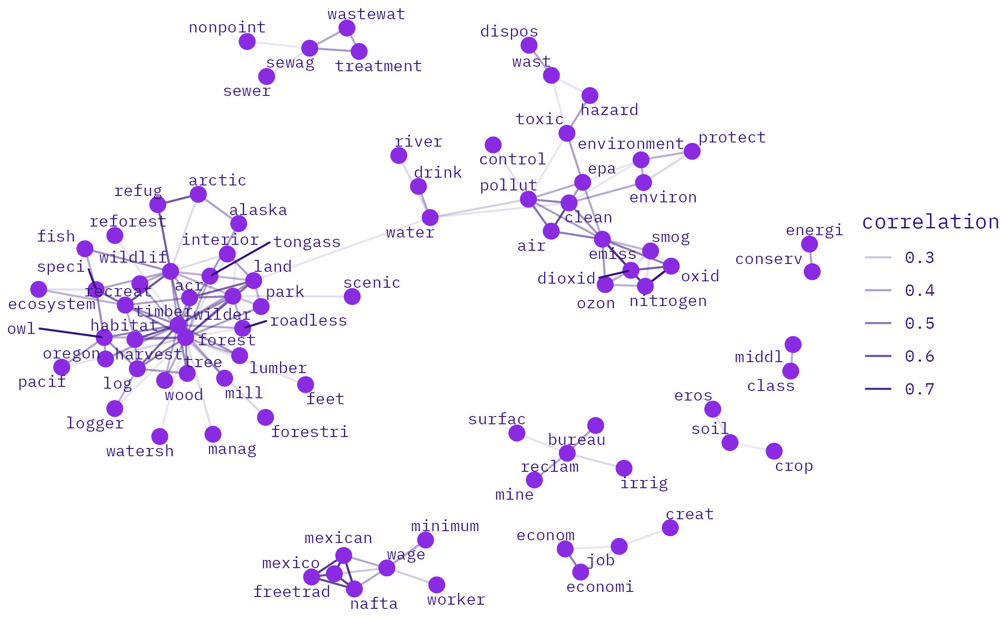

# ENVIRO-LABOR

## co-occurrence

### 25-yr

#### co-occurrences with enviro keywords in enviro-labor speeches

```{r}

# enviroVocab_simple <- c("^environ",
#                         "^ecolog",
#                         "^ecosyst",
#                         "^outdoor",
#                         "^conserv",
#                         "^reclam",
#                         "^pollut",
#                         "^wildlif",
#                         "^wilder") %>%
#   as_tibble()

enviroVocab_simple

```


<center><b>1875</b></center>

{width=100%}

<center><b>1900</b></center>

{width=100%}


<center><b>1925</b></center>

{width=100%}

<center><b>1950</b></center>

{width=100%}

<center><b>1975</b></center>

{width=100%}

<center><b>2000</b></center>

{width=100%}

#### co-occurrences with labor keywords in enviro-labor speeches
```{r}

# laborVocab_simple <- c("^labor$",
#                        "^worker$",
#                        "^job$",
#                        "^wage$",
#                        "^class$") %>%
#   as_tibble()

laborVocab_simple

```

<center><b>1875</b></center>

{width=100%}

<center><b>1900</b></center>

{width=100%}


<center><b>1925</b></center>

{width=100%}

<center><b>1950</b></center>

{width=100%}

<center><b>1975</b></center>

{width=100%}

<center><b>2000</b></center>

{width=100%}


#### co-occurrences with enviro-labor keywords in enviro-labor speeches
```{r}

# enviroVocab_simple2 <- c("^environ",
#                         "^ecolog",
#                         "^ecosyst",
#                         "^outdoor",
#                         "^conserv",
#                         "^reclam",
#                         "^pollut",
#                         "^wildlif",
#                         "^wilder")
# 
# laborVocab_simple2 <- c("^labor$",
#                        "^worker$",
#                        "^job$",
#                        "^wage$",
#                        "^class$")

enviroLaborVocabString_simple <- c(enviroVocab_simple2,laborVocab_simple2) %>%
  as_tibble()

enviroLaborVocabString_simple

```

<center><b>1875</b></center>

{width=100%}

<center><b>1900</b></center>

{width=100%}


<center><b>1925</b></center>

{width=100%}

<center><b>1950</b></center>

{width=100%}

<center><b>1975</b></center>

{width=100%}

<center><b>2000</b></center>

{width=100%}


### 10-yr

#### co-occurrences with enviro-labor keywords in enviro-labor speeches

```{r}

enviroLaborVocabString_simple

```

<center><b>1900</b></center>

{width=100%}

<center><b>1910</b></center>

{width=100%}

<center><b>1920</b></center>

{width=100%}

<center><b>1930</b></center>

{width=100%}

<center><b>1940</b></center>

{width=100%}

<center><b>1950</b></center>

{width=100%}

<center><b>1960</b></center>

{width=100%}

<center><b>1970</b></center>

{width=100%}

<center><b>1980</b></center>

{width=100%}

<center><b>1990</b></center>

{width=100%}

<center><b>2000</b></center>

{width=100%}

<center><b>2010</b></center>

{width=100%}

<center><b>2020</b></center>

{width=100%}

